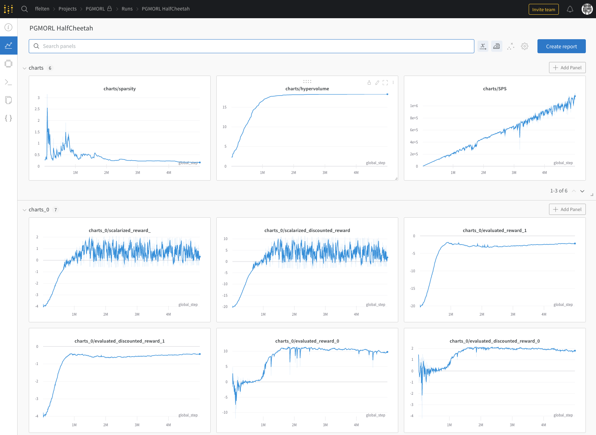

[](https://www.repostatus.org/#active)
[](https://github.com/LucasAlegre/mo-gym/blob/main/LICENSE)
[](https://discord.gg/ygmkfnBvKA)
[](https://github.com/psf/black)

# MORL Baselines
<div style="text-align: center;">

</div>

MORL Baselines is a library of Multi-Objective Reinforcement Learning (MORL) algorithms. 
This repository aims at containing reliable MORL algorithms implementations in PyTorch.

MORL Baselines stricly follows [MO-Gym](https://github.com/LucasAlegre/mo-gym) API, which differs from the standard [Gymnasium](https://github.com/Farama-Foundation/Gymnasium) API only in that the environment returns a numpy array as the reward.

For details on multi-objective MDP's (MOMDP's) and other MORL definitions, we suggest reading [A practical guide to multi-objective reinforcement learning and planning](https://link.springer.com/article/10.1007/s10458-022-09552-y).

## Implemented Algorithms

| Algo                                                                                                                                                                 | Single/Multi-policy | ESR/SER | Observation space | Action space | Paper                                                                                                                       |
|----------------------------------------------------------------------------------------------------------------------------------------------------------------------|---------------------|---------|------------------|--------------|-----------------------------------------------------------------------------------------------------------------------------|
| [Envelope Q-Learning](https://github.com/LucasAlegre/morl-baselines/blob/main/morl_baselines/multi_policy/envelope/envelope.py)                                      | Multi               | SER     | Continuous       | Discrete     | https://arxiv.org/pdf/1908.08342.pdf                                                                                        |
| [PGMORL](https://github.com/LucasAlegre/morl-baselines/blob/main/morl_baselines/multi_policy/pgmorl/pgmorl.py)                                                       | Multi               | SER     | Continuous       | Continuous   | https://people.csail.mit.edu/jiex/papers/PGMORL/paper.pdf / https://people.csail.mit.edu/jiex/papers/PGMORL/supp.pdf        |
| [Pareto Q-Learning](https://github.com/LucasAlegre/morl-baselines/blob/main/morl_baselines/multi_policy/pareto_q_learning/pql.py)                                    | Multi               | SER     | Discrete         | Discrete     | https://jmlr.org/papers/volume15/vanmoffaert14a/vanmoffaert14a.pdf                                                          |
| [MO Q learning](https://github.com/LucasAlegre/morl-baselines/blob/main/morl_baselines/single_policy/ser/mo_q_learning.py)                                           | Single              | SER     | Discrete         | Discrete     | https://www.researchgate.net/publication/235698665_Scalarized_Multi-Objective_Reinforcement_Learning_Novel_Design_Techniques                                                                                                                             |
| [MPMOQLearning](https://github.com/LucasAlegre/morl-baselines/blob/main/morl_baselines/multi_policy/multi_policy_moqlearning/mp_mo_q_learning.py)  (outer loop MOQL) | Multi               | SER     | Discrete         | Discrete     | https://www.researchgate.net/publication/235698665_Scalarized_Multi-Objective_Reinforcement_Learning_Novel_Design_Techniques |
| [Optimistic Linear Support (OLS)](https://github.com/LucasAlegre/morl-baselines/blob/main/morl_baselines/multi_policy/ols/ols.py)                                    | Multi               | SER     | /                | /            | Section 3.3 of http://roijers.info/pub/thesis.pdf     |
| [Expected Utility Policy Gradient (EUPG)](https://github.com/LucasAlegre/morl-baselines/blob/main/morl_baselines/single_policy/esr/eupg.py)                          | Single              | ESR     | Discrete         | Discrete     |   https://www.researchgate.net/publication/328718263_Multi-objective_Reinforcement_Learning_for_the_Expected_Utility_of_the_Return                                                    |

## Structure
As much as possible, this repo tries to follow the single-file implementation rule for all algorithms.

* `examples/` contains a set of examples to use MORL Baselines with mo-gym environments.
* `common/` contains the implementation recurring concepts: replay buffers, neural nets, etc.
* `multi_policy/` contains the implementations of multi-policy algorithms.
* `single_policy/` contains the implementations of single-policy algorithms.

## Utilities

Performances are automatically reported in Weights and Biases dashboards



## Citing the Project

```bibtex
@misc{morl_baselines,
    author = {Florian Felten and Lucas N. Alegre},
    title = {MORL-Baselines: Multi-Objective Reinforcement Learning algorithms implementations},
    year = {2022},
    publisher = {GitHub},
    journal = {GitHub repository},
    howpublished = {\url{https://github.com/LucasAlegre/morl-baselines}},
}
```

## Maintainers

MORL-Baselines is currently maintained by [Florian Felten](https://ffelten.github.io/) (@ffelten) and [Lucas N. Alegre](https://www.inf.ufrgs.br/~lnalegre/) (@LucasAlegre).

## Acknowledgements
* Willem Röpke, for his implementation of Pareto Q-Learning (@wilrop)
* Denis Steckelmacher and Conor F. Hayes, for providing us with the original implementation of EUPG.